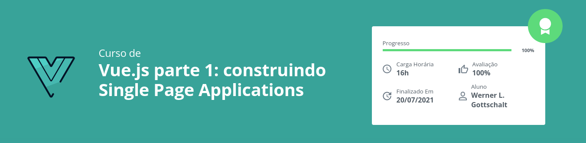

# Vue.Js 3 Studies Project

## Parte 1

### Na parte 1 do curso vimos os seguintes tópicos:

-   Faça esse curso de Frameworks MVC e:
-   Construa do zero uma Single Page Application
-   Crie seus próprios componentes
-   Domine o data binding, diretivas, rotas e views
-   Aplique boas práticas do início ao fim
-   Integre com o backend NodeJS como exemplo

| Info    | Status    |
| ------- | --------- |
| Branch: | V1        |
| Status: | Completed |
| Merged: | main      |

## README.md

🚧 Under Construction 🚧
